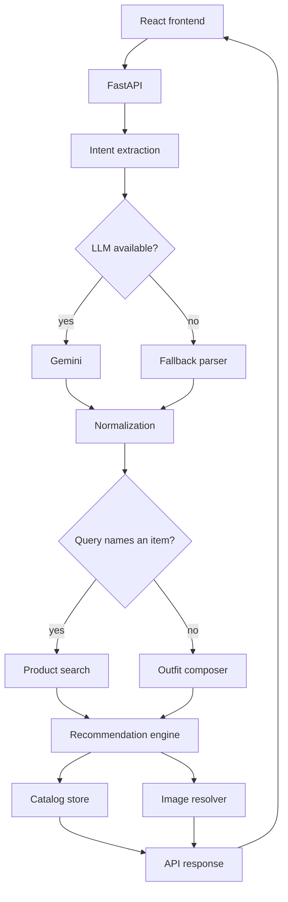

# StyleSync

StyleSync is an outfit recommendation system built on a catalog of 43,165 real
fashion, footwear, accessory and beauty products. You type what you are wearing
or what you are looking for in normal language, and it returns matching products
plus the items that go with them. It was built as a technical assignment on
recommendation systems.

## What this project does

There are two things you can ask it:

**Search for something.** Type "black formal shirt" and you get black formal
shirts first, ranked by how well they match what you asked for. Below those, the
trousers, shoes and watch that would go with them.

**Ask for a whole outfit.** Type "office wear for men" and you get a full look:
a shirt, trousers, formal shoes and accessories. Nothing in the query names a
product, so the system builds the outfit instead of searching for one item.

Every product comes from the catalog, and each one shows a short line explaining
why it was picked.

## Why I built it

I wanted a recommendation problem that was not just "find similar items".
Similarity is the easy version: if someone is holding a saree, showing them
another saree is a search problem with an obvious answer. Showing them the
lipstick that goes with it is not, because there is no purchase history linking
a saree to a lip colour. That relationship has to be worked out from product
attributes: colour, occasion, formality.

There was a second problem I found while building it, and it turned out to be
the more interesting one. A system that only knows "what goes with what" will
answer a search for "red shirt" with a handbag, because the handbag really does
go with a red shirt. It is a correct answer to a question nobody asked. Keeping
"does this match what I searched for" separate from "does this go with it" ended
up being the main design decision in the project.

## How it works

```
user query
  -> intent extraction (Gemini, or a fallback parser)
  -> normalization against the catalog vocabulary
  -> filtering (gender, category, exclusions)
  -> scoring
  -> ranking and diversity
  -> recommendations
```

The query is turned into structured fields: garment, colour, occasion, style,
gender, and whether the user already owns the item. Gemini does this when an API
key is set. When it is not, or when the API is unavailable, a rule-based parser
does the same job with a fixed vocabulary.

Whatever comes back is checked against the catalog's own vocabulary. If the
parser returns a colour or category the catalog does not have, it is dropped and
reported instead of guessed.

After that the query is routed. If it names a garment or a category, it goes to
product search. If it names nothing to buy, it goes to outfit composition. If
the user says they already own the garment ("I'm wearing a black saree"), only
complements are returned.

The engine then filters candidates, scores them, and runs a diversity pass so
one brand or colour cannot fill a whole section.

## Recommendation approach

This is content and attribute based. There is no collaborative filtering,
because the dataset has no user interactions, ratings or purchase history. There
was nothing to learn preferences from, so I did not pretend otherwise.

The item you searched for and the items that go with it are scored differently,
because they answer different questions.

**The item you searched for:**

| Signal | Weight |
|---|---|
| Category match | 0.34 |
| Colour match | 0.26 |
| Occasion suitability | 0.22 |
| Style match | 0.10 |
| Text relevance (TF-IDF) | 0.08 |

**Complementary items:**

| Signal | Weight |
|---|---|
| Colour harmony | 0.35 |
| Occasion suitability | 0.25 |
| Category affinity | 0.18 |
| Preference match | 0.14 |
| Text relevance (TF-IDF) | 0.08 |

A few notes on the choices:

- Scores are a weighted mean over the signals that are actually present. If a
  product has no data for a signal, that signal is skipped rather than filled in
  with a neutral 0.5, so products are not rewarded for missing data.
- Gender is a filter, not a score. A men's kurta is not a worse match for a
  women's outfit, it is the wrong answer, so it never becomes a candidate.
- Colour harmony comes from hue distance between colour families, with separate
  handling for neutrals and metallics.
- Occasion for clothing is read from the catalog's occasion column through a
  compatibility map. For beauty it is derived from shade and finish instead,
  because the source labels are unusable (see Dataset).
- Text relevance has the smallest weight because I measured it. On 12 queries
  where correctness could be checked from attributes, attribute filtering scored
  1.00 precision@10, sentence embeddings 0.92 and TF-IDF 0.84. Text helps with
  material and pattern words and not much else, so it stays small.

The full scoring detail is in [docs/recommendation-method.md](docs/recommendation-method.md).

## Architecture



More detail in [docs/architecture.md](docs/architecture.md).

## Tech stack

- Python 3.13, FastAPI, Pydantic
- pandas and PyArrow over a Parquet catalog
- scikit-learn for TF-IDF text relevance
- Google Gemini for intent extraction, with a rule-based fallback parser
- React 19, Vite, Tailwind CSS, React Router
- Pillow for images
- pytest

No database server, queue or ORM. The catalog fits in memory, so it is loaded
once at startup.

## Dataset

The catalog is built from
[`ashraq/fashion-product-images-small`](https://huggingface.co/datasets/ashraq/fashion-product-images-small),
the Kaggle Fashion Product Images dataset (MIT licence as declared by the
source).

After processing: 43,165 products, 30 category groups, 136 product types, 392
brands, of which 2,133 are beauty products.

Preprocessing normalizes colours into 15 families, maps product types into
category groups, derives occasion, tags each product as an anchor or a
complement, and de-duplicates on image hash rather than name (38.9% of the
catalog shares a display name with something else).

Things worth knowing about the data:

- No prices, ratings, reviews or stock. The dataset has none, so the app shows
  none.
- The occasion column is not reliable for beauty products. 2,136 of the 2,139
  personal care items are labelled "Casual", so beauty suitability is derived
  from shade and finish instead.
- Some records are wrong at source. A few products have the wrong photograph
  attached, and one novelty T-shirt is labelled "formal".
- Images ship as 60x80 thumbnails. Larger versions are fetched on demand from a
  900x1200 mirror of the same dataset and cached on disk.

No dataset files are committed. `scripts/ingest_catalog.py` builds everything
from the public source. Details in [docs/dataset.md](docs/dataset.md).

## Running locally

You need Python 3.11+ and Node 18+.

```bash
# install backend dependencies
pip install -r requirements-dev.txt

# build the catalog (downloads the dataset, a few minutes, about 90 MB)
python scripts/ingest_catalog.py

# start the API
python -m uvicorn src.api.app:app --reload --port 8000

# in a second terminal, start the frontend
cd frontend
npm install
npm run dev
```

Then open <http://localhost:5173>.

### Environment variables

Copy `.env.example` to `.env` and add one key. The file is git-ignored and is
only read by the backend, never sent to the browser.

```
GEMINI_API_KEY=your_key_here
# ANTHROPIC_API_KEY=your_key_here

# optional
# LLM_PROVIDER=gemini
# LLM_MODEL=gemini-flash-lite-latest
```

If you leave it unset the app still runs, using the fallback parser.

To check which mode is active:

```bash
python scripts/check_llm.py
```

### Tests

```bash
python -m pytest tests/ -q
```

328 tests. They run offline, since the LLM and the image fetcher are switched
off in the test configuration.

## Example queries

| Query | What you get |
|---|---|
| `black formal shirt` | Black formal shirts, then trousers, shoes and a watch |
| `red saree for a wedding` | Red sarees, then jewellery, footwear and beauty |
| `office wear for men` | A full outfit: shirt, trousers, formal shoes, accessories |
| `sport outfit for marathon` | Running top, bottoms, running shoes, essentials |
| `I'm wearing a black saree to a wedding` | Complements only, since the saree is already owned |
| `perfume` or `sunglasses` | That category leads the results |

## Evaluation

There is no ground truth here. The catalog has no user interactions, so nothing
records which product a person would actually pick. Precision, recall, NDCG and
MAP all need relevance labels, and those labels do not exist for this dataset, so
I did not report them. Making them up would have meant making up the labels too.

Instead each test scenario declares in advance what a correct answer has to look
like, and those properties are checked automatically. The expectations were
written before the evaluator was run.

From `scripts/evaluate_engine.py`:

| Metric | Result |
|---|---|
| Scenarios passed | 15 / 15 |
| Constraint satisfaction | 1.00 |
| Colour compatibility | 0.91 |
| Explanation completeness | 1.00 |
| Candidate coverage | 0.93 |
| Mean categories per result | 4.87 |
| Mean distinct brands | 5.2 |
| Largest single brand share | 0.28 |
| Latency | 240 ms mean |

Constraint satisfaction checks that every product returned exists in the
catalog, is a valid complement, and respects gender and category exclusions.
Colour compatibility is the share of colour-carrying products whose harmony with
the anchor is above threshold. The brand numbers are there because the diversity
pass is easy to get wrong and hard to notice by eye.

The scenarios include six normal cases and nine failure or edge cases:

| Scenario | Behaviour |
|---|---|
| Unknown product id | 404 with a message, no substitute guessed |
| Every category excluded | Empty result and a warning, filter not ignored |
| Unsupported occasion | Reported as unrecognised |
| Query with nothing usable in it | Says so, returns a broad selection |
| Saree for the gym | Returns what the catalog can support, with a warning |
| Rare category on its own | Marked thin rather than padded out |
| Outfit with no gender given | Asks which one before building anything |

Full results in [docs/evaluation.md](docs/evaluation.md).

## Assumptions and design decisions

- Structured inputs override anything parsed from the query text. An explicit
  gender or colour in the request wins.
- Gender filters candidates instead of scoring them.
- An outfit request with no gender asks rather than guessing, because mixing
  men's and women's clothing into one outfit is never right.
- Owning a garment is treated differently from shopping for one.
- The LLM only extracts intent. It never sees the catalog, cannot rank and
  cannot return a product, so it cannot invent one.
- Missing catalog fields are left missing. No prices or ratings are generated.
- Returning fewer results is better than padding with weak matches.

## Limitations

- Recommendation quality depends on catalog quality. Where the source data is
  wrong, for example a product with the wrong photograph or a mislabelled
  occasion, the output reflects that.
- Some product images are poor at source. Larger versions are fetched where they
  exist, but a few are soft even at full size, and those are marked rather than
  presented as sharp.
- Gemini depends on API quota and provider availability. The free tier has a
  daily limit and the service returns 503 when busy.
- When the LLM is unavailable the fallback parser takes over. It works, but it
  uses a fixed vocabulary of roughly 35 garment words and 60 colour words, so it
  handles unusual phrasing less well. The interface shows which mode produced
  the current result.
- Category affinity weights are values I chose, not values learned from data.
  There is no interaction data to learn them from.
- The colour model uses hue only, without saturation or lightness. It can rank
  colour pairings but cannot detect a genuine clash.
- Some categories are thin. Mascara has 12 products, concealer 11, men's ethnic
  bottoms 6. Those sections say they are thin instead of filling up with poor
  matches.
- No personalization. There are no user accounts and no history, so results
  depend only on the current query.

More in [docs/limitations.md](docs/limitations.md).

## Future improvements

- Widen the fallback parser's vocabulary, or give it fuzzy matching, so it
  degrades less when the LLM is unavailable.
- Pre-fetch high resolution images for the whole catalog instead of on demand,
  which would remove the delay on first view of a product.
- Add a check during ingestion that flags products whose image does not match
  their category, since that is the most visible data problem.
- Cache intent extraction results for repeated queries, which would reduce API
  calls and help with the daily quota.
- If any usage data existed, replace the hand-set category affinity weights with
  values derived from it, and use it to build a proper relevance test set.

## Deployment

Not deployed yet. The app runs locally with the commands above.

To deploy it, the backend needs a host with enough disk for the catalog and
image store (around 90 MB, built by the ingest script), the frontend needs to be
built and pointed at that backend, and `GEMINI_API_KEY` needs to be set in the
host environment.

## Project structure

```
src/
  catalog/     dataset to catalog schema
  engine/      scoring, ranking, colour, occasion, diversity
  intent/      query to structured intent, providers and fallback parser
  outfit/      outfit shapes and composition
  api/         FastAPI app, response models, images, explanations
frontend/src/
  pages/       home, results, product, browse, how it works
  components/  search bar, product card, outfit view, header
  api/         fetch client
scripts/       ingest, evaluation, benchmark, image fetch, LLM check
tests/         328 tests
docs/          architecture, recommendation method, evaluation, dataset, limitations
```
