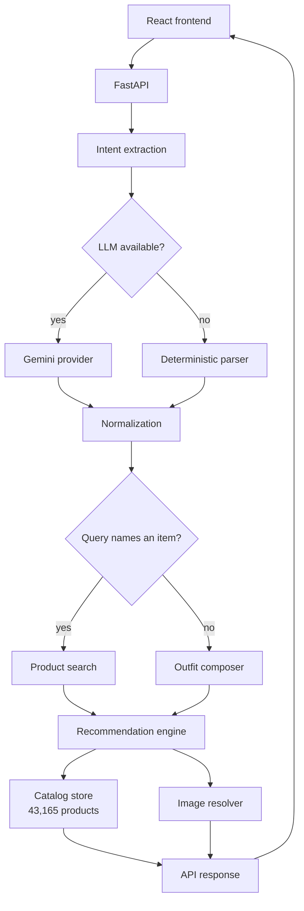

# StyleSync

Find your look. Build your outfit.

## Project Overview

StyleSync is a fashion and outfit recommendation system. You describe what you
are wearing or what you are looking for in plain language, and it returns real
products from a catalog of 43,165 items across clothing, footwear, accessories
and beauty.

It answers two different questions and keeps them separate:

- **What you asked for.** Search for "black formal shirt" and you get black
  formal shirts, ranked on how well they match the request.
- **What goes with it.** Below those, the trousers, shoes, watch or bag that
  work with the item you searched for.

If a query names no garment ("office wear for men"), the system builds a
complete outfit instead: a main piece, bottoms, footwear and accessories.

Recommendations use intent extracted from the query (garment, colour, occasion,
style, gender), colour compatibility, occasion suitability and category
relationships. Every product returned is a real catalog item with a short
explanation of why it was chosen.

## Problem Statement

Catalog search answers "what is similar to this?". It matches words against
product text and returns more of the same kind of thing. It does not know that a
red shirt for an office needs different trousers than a red shirt for a party,
and it has no opinion about what to wear with either.

There is a second problem specific to recommendation. A system that only models
"what goes with what" will answer a search for "red shirt" with a handbag,
because the handbag genuinely does go with a red shirt. That is a correct answer
to a question nobody asked. Keeping "does this match my request?" separate from
"does this go with it?" is the core design problem here.

## Use Case and Motivation

Someone has an item, or an occasion, and needs the rest of the outfit. That is a
compatibility problem rather than a similarity problem, and it is harder in an
interesting way.

Recommending another saree to someone holding a saree has an obvious answer.
Recommending the lipstick does not. There is no "customers also bought" edge
between a drape and a lip colour, so compatibility has to be modelled from
attributes: colour relationships, occasion formality, metal tone.

This is only possible because fashion and beauty products sit in the same
dataset under the same colour vocabulary. A black saree and a maroon lipstick
are described in one attribute space, so the comparison is computable rather
than guessed across two unrelated sources.

## Demo

**Deployment: Pending.** The application has not been deployed. It currently
runs locally, using the commands under [Running Locally](#running-locally).

What remains to deploy:

1. Host the FastAPI backend (the catalog and image store total roughly 90 MB and
   are built by a script, so the host needs persistent disk or a build step).
2. Build the frontend and serve it as static files, pointing the API base URL at
   the deployed backend.
3. Set `GEMINI_API_KEY` in the host's environment. Without it the app still runs
   on the deterministic parser.

## How It Works

```
User query
  -> intent extraction (Gemini, or the deterministic parser)
  -> normalization against the catalog vocabulary
  -> recommendation engine (scoring, ranking, diversity)
  -> real catalog products
  -> FastAPI response
  -> React interface
```

1. **Intent extraction.** The query becomes structured fields: garment, colour,
   occasion, style, gender, and whether the user already owns the garment. A
   language model does this when a key is configured; otherwise a deterministic
   parser does. The model never sees the catalog and cannot return a product.
2. **Normalization.** Extracted values are checked against the catalog's own
   vocabulary. Anything unrecognised is dropped and reported, not guessed.
3. **Routing.** A query naming a garment or category goes to product search. A
   query naming nothing to buy goes to outfit composition. A query saying the
   user already owns the garment returns complements only.
4. **Scoring and ranking.** The engine scores candidates, then a diversity pass
   prevents one brand or colour from filling a section.
5. **Response.** The API returns real catalog products with reasons, image
   references and category metadata.

## Recommendation Approach

This is content and attribute based. There is no collaborative filtering,
because the dataset has no user interactions.

**The item you searched for** is scored on how closely it matches the request:

| Signal | Weight |
|---|---|
| Category match | 0.34 |
| Colour match | 0.26 |
| Occasion suitability | 0.22 |
| Style match | 0.10 |
| Text relevance (TF-IDF) | 0.08 |

**Complementary items** are scored on how well they go with it:

| Signal | Weight |
|---|---|
| Colour harmony | 0.35 |
| Occasion suitability | 0.25 |
| Category affinity | 0.18 |
| Preference match | 0.14 |
| Text relevance (TF-IDF) | 0.08 |

Scores are a weighted mean over active components only, so a missing signal is
treated as absent rather than as a neutral 0.5. Gender is a filter, not a score:
a product of the wrong gender is never a candidate.

Colour harmony is computed from hue distance between colour families, with
separate handling for neutrals and metallics. Occasion suitability for clothing
reads the catalog's occasion column through a compatibility map; for beauty it
is derived from shade family and finish, because the source occasion labels are
unusable. A greedy MMR pass re-ranks for diversity.

Full detail is in [docs/recommendation-method.md](docs/recommendation-method.md).

## Dataset

- **Source:** [`ashraq/fashion-product-images-small`](https://huggingface.co/datasets/ashraq/fashion-product-images-small),
  the Kaggle Fashion Product Images dataset. MIT licence as declared by the
  source.
- **Size after processing:** 43,165 products, 30 category groups, 136 product
  types, 392 brands. 2,133 are beauty products.
- **Attributes used:** product type, category group, base colour and derived
  colour family, occasion, gender, brand, and a text blob for TF-IDF.
- **Preprocessing:** normalizing colours into 15 families, mapping product types
  into category groups, deriving occasion, tagging each product as anchor or
  complement, and de-duplicating on image hash rather than name (38.9% of the
  catalog shares a display name).
- **Images:** the dataset ships 60x80 thumbnails. Higher resolution images are
  fetched on demand from a public 900x1200 mirror of the same dataset and cached.

No dataset files are committed. `scripts/ingest_catalog.py` rebuilds everything
from the public source. Details in [docs/dataset.md](docs/dataset.md).

## System Architecture



More detail in [docs/architecture.md](docs/architecture.md).

## Tech Stack

| Layer | Technology |
|---|---|
| Backend | Python 3.13, FastAPI, Pydantic |
| Data | pandas, PyArrow, Parquet catalog |
| Text relevance | scikit-learn TF-IDF |
| Intent extraction | Google Gemini, with a deterministic fallback parser |
| Frontend | React 19, Vite 7, Tailwind CSS 4, React Router |
| Images | Pillow |
| Tests | pytest |

There is no database server, queue, cache layer or ORM. The catalog fits in
memory.

## Evaluation

The catalog has no user interactions, so there is no ground truth about which
product a person would choose. Precision, recall, NDCG and MAP need relevance
labels that do not exist here, so they are not reported. Inventing them would
mean inventing the labels.

Instead the engine is evaluated against 15 scenarios that declare, in advance,
the properties a correct answer must have. Those properties are then checked
mechanically. Expectations were written before the evaluator was run.

Current results, from `scripts/evaluate_engine.py`:

| Metric | Result | What it measures |
|---|---|---|
| Scenarios passed | 15 / 15 | Declared expectations met |
| Constraint satisfaction | 1.00 | Every product exists in the catalog, is a valid complement, and respects exclusions and gender |
| Colour compatibility | 0.91 | Share of colour-carrying products whose harmony against the anchor is above threshold |
| Explanation completeness | 1.00 | Share of products carrying at least one reason and one scored component |
| Candidate coverage | 0.93 | Categories that produced a recommendation, over categories considered |
| Mean category coverage | 4.87 | Distinct categories in a returned look |
| Mean distinct brands | 5.2 | Brand spread per result set |
| Max brand share | 0.28 | Largest share held by one brand |
| Latency | 240 ms mean | One recommend() call on a warm engine |

A separate retrieval benchmark compares text methods on 12 attribute-checkable
queries, measuring precision@10 against an attribute filter as the reference:
structured filtering 1.00, embeddings 0.92, TF-IDF 0.84. This is why text
relevance carries the smallest weight in the scoring formula, and why sentence
embeddings were measured and then not adopted.

Full results in [docs/evaluation.md](docs/evaluation.md).

## Test Cases

### Successful scenarios

| Query | Result |
|---|---|
| "black formal shirt" | Black formal shirts first, then trousers, shoes and a watch |
| "red saree for a wedding" | Six red sarees, then jewellery, footwear and beauty |
| "I'm wearing a black saree to a wedding, suggest an elegant look" | Complements only, because the user already owns the saree |
| "office wear for men" | A full outfit: shirt, trousers, formal shoes, accessories |
| "sport outfit for marathon" | Running top, running bottoms, running shoes, essentials |
| "perfume" / "sunglasses" | The named category leads the results |

### Failure and edge scenarios

These are covered in the evaluation suite and behave as documented:

| Scenario | Behaviour |
|---|---|
| Unknown anchor product id | 404 with an explanation, no guessed substitute |
| Every category excluded | Empty result with a warning rather than an ignored filter |
| Unsupported occasion | Reported as unrecognised, not silently mapped |
| Uninterpretable query ("zzzz qqqq wubble") | Says nothing usable was extracted, returns a broad selection |
| Impossible combination (saree for the gym) | Returns what the catalog can support, with a warning |
| Rare category requested alone | Marked as thin rather than padded with poor matches |
| Outfit requested with no gender | Asks which gender before building anything |
| Gemini quota exhausted or 503 | Falls back to the deterministic parser; the interface shows "Catalog matching" |
| Product with a wrong or poor source photograph | Reported as low quality rather than presented as sharp |

### Automated tests

328 tests covering catalog normalization, engine scoring, API contracts, outfit
composition, intent extraction, image handling and provider failure
classification.

## Assumptions and Key Design Decisions

- **Structured inputs override values extracted from the query.** If the request
  carries an explicit gender or colour, that wins over the parsed value.
- **Gender is a hard filter, not a score.** A product of the wrong gender is
  never a candidate.
- **An outfit request without a gender asks instead of guessing.** Mixing men's
  and women's clothing into one outfit is never a correct answer.
- **Owning a garment is different from shopping for one.** "I'm wearing a black
  saree" returns complements. "Black saree for a wedding" returns sarees.
- **The language model only extracts intent.** It never sees the catalog, never
  ranks and cannot return a product. The system works without it.
- **Missing catalog fields are not fabricated.** No prices, ratings, reviews,
  stock or popularity, because the dataset has none.
- **Weighted mean over active components only.** A missing signal is absent, not
  a neutral 0.5, so products are not rewarded for having no data.
- **Fewer results beat padded results.** If the catalog cannot answer well, the
  API says so and returns less.

## Known Limitations

Summarised here, with detail in [docs/limitations.md](docs/limitations.md).

- No collaborative filtering or personalization. The dataset has no user
  interactions, so category affinity weights are declared priors rather than
  learned values.
- The colour model uses hue only, without saturation or lightness, so it
  expresses a preference ordering rather than detecting clashes.
- Beauty occasion suitability is derived from shade and finish, because the
  source labels 2,136 of 2,139 personal care products "Casual".
- Some categories are thin (mascara 12 products, concealer 11, men's ethnic
  bottoms 6). These are reported as thin rather than padded.
- A few source records carry the wrong photograph or a wrong occasion label.
- The deterministic parser uses a fixed vocabulary, so it handles unusual
  phrasing less well than the language model.
- The Gemini free tier is limited per day and returns 503 when busy. Either
  switches the app to catalog matching.

## Future Improvements

- Broader semantic intent handling, so the fallback path understands phrasing
  outside its fixed vocabulary.
- Wider high-resolution image coverage, fetched ahead of time rather than on
  demand.
- Validation of source data to catch wrong photographs and bad occasion labels.
- User feedback signals, which would allow category affinities to be learned
  rather than declared.
- Personalization from interaction history.
- Offline relevance evaluation with labelled judgements, which would make
  precision and NDCG meaningful.
- Deployment with monitoring for latency and provider failures.

## Running Locally

Requires Python 3.11+ and Node 18+.

```bash
# 1. Install backend dependencies
pip install -r requirements-dev.txt

# 2. Build the catalog from the public dataset (a few minutes, ~90 MB)
python scripts/ingest_catalog.py

# 3. Start the API
python -m uvicorn src.api.app:app --reload --port 8000

# 4. Start the frontend, in a second terminal
cd frontend
npm install
npm run dev
```

Open <http://localhost:5173>.

To check whether intent extraction is using the language model or the fallback:

```bash
python scripts/check_llm.py
```

## Environment Variables

Copy `.env.example` to `.env`. The file is git-ignored, is read by the backend
process only, and is never bundled into the frontend.

```
GEMINI_API_KEY=your_key_here
# ANTHROPIC_API_KEY=your_key_here

# Optional
# LLM_PROVIDER=gemini
# LLM_MODEL=gemini-flash-lite-latest
```

Leave them unset to run on the deterministic parser.

## Testing

```bash
python -m pytest tests/ -q
```

328 tests. They run offline: the language model and the image fetcher are
disabled in the test configuration so results do not depend on a network call.

## Project Structure

```
src/
  catalog/     dataset to catalog schema
  engine/      scoring, ranking, colour harmony, occasion fit, diversity
  intent/      query to structured intent, providers and fallback parser
  outfit/      outfit shapes per gender and occasion, look composition
  api/         FastAPI app, response models, images, explanations
frontend/src/
  pages/       home, results, product, browse, how it works
  components/  search bar, product card, outfit view, header
  api/         fetch client
scripts/       catalog ingest, evaluation, benchmark, image fetch, LLM check
tests/         328 tests
docs/          architecture, recommendation method, evaluation, dataset, limitations
```
